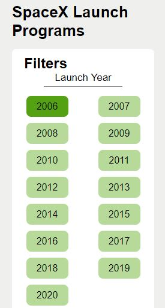
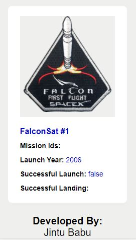
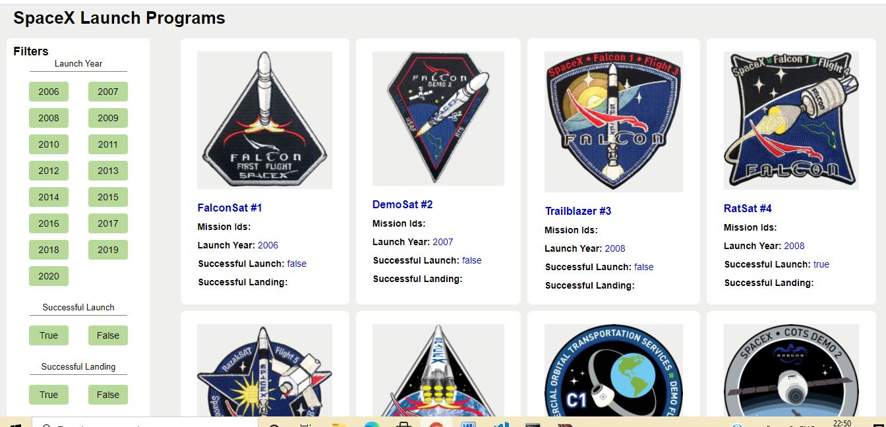

<!-- PROJECT LOGO -->
<p align="center">
  <h3 align="center">SpaceX-Launch-programs-Demo</h3>
  <p align="center">
    This document contains a brief description about the application and its features, setup instructions, and implementation in detail.
  </p>
</p>

<!-- TABLE OF CONTENTS -->
## Table of Contents

* [About the Project](#about-the-project)
* [Getting Started](#getting-started)
  * [Prerequisites](#prerequisites)
  * [Installation](#installation)
* [Usage](#usage)
* [Implementation](#implementation)
* [Contact](#contact)


<!-- ABOUT THE PROJECT -->
## About The Project
This project was generated with [Angular CLI](https://github.com/angular/angular-cli) version 8.1.0.
The application is a responsive web app that support mobile, tablet and dektop resolution. Application is server side rendered and the setup instructions are described under the following contents.
Mobile view is set up to a screen resolution of 700px. From 700px to 1024px resolution is considered as tablet resolution and from 1024px it shows desktop view with maximum screen width as 1440px, beyond which, the page will be centre aligned.


### Prerequisites
* NodeJs 
If you do not have NodeJs installed in your system, get it from [https://nodejs.org/en/download/](https://nodejs.org/en/download/)

* npm
If you do not have latest version of npm, use the following command to update the package

```sh
npm install npm@latest -g
```

### Installation

#### 1. Clone the repo

```sh
git clone https://github.com/jintzz/spaceX-launch-programs.git
```
use git GUI or git bash based on your convenience. <br/>
You can also download the .zip folder and extract files if GIT is not installed.

#### 2. Install NPM packages
Run the following command from inside the cloned repo.

```sh
npm install
```

#### 3. Build the application
Use following command to generate a dist folder to enable server side rendering or (SSR)

```sh
npm run build:ssr
```
This step is optional. You may or may not skip this step since dist folder is already attached with the project.

#### 4. Serve the application
Use following command to launch the application

```sh
npm run serve:ssr
```
You can see the application running at port:4000.
URL: http://localhost:4000/

#### 5. Unit Testing
Run `ng test` to execute the unit tests via [Karma](https://karma-runner.github.io).

```sh
ng test
```

## Usage
<p>
    
    
    
</p>

This project helps user to view the SpaceX mission details and filter the results based on the Launch Year, Launch status and landing status.
<br/> On hitting the base url (http://localhost:4000/) user will be automatically redirected to the landing page (http://localhost:4000/launchBoard), where the filter and the mission details are listed.
 <br/>
 User is allowed to change the filter selections by clicking different options given under different categories such as Launch Year, Successful Launch, and Successful Landing.
No filter will be applied during initial load, i.e., the whole content will be loaded on initial load. 
Upon changing the filter selections, selected values/conditions will be appearing in the url (e.g.: http://localhost:4000/launchBoard?&launch_year=2010&launch_success=true), and data will be updated without refreshing the page.
The filter buttons have toggle behaviour under each category, i.e., on clicking a  selected button again, the selection will be gone and the url will be updated.

## Implementation

We have made use of Angular Universal for SSR or server side rendering of the application
```sh
ng add @nguniversal/express-engine
```
Bulding and serving the application using Express server makes it SSR.(Please refer [Installation](#installation)).  Unlike normal client side rendered applications that loads in port :4200, SSR applications are loaded in port:4000.
<br/>
The app.component.html file contains the layout of the landing page, consisting of header, a content wrapper in which router-outlet is added, and a footer.
<br/>
Default routing is set to '/launchBoard' which is considered as the landing page. The filter logics are handled under the filter component.
Following are the main components used inside this application:

#### 1. App Component: 
Basic component that contain the primary layout
#### 2. App routing module:
Handle the routes in the application
#### 3. App server module:
Enable SSR implementation and handle routes
#### 4. Filter component:
Handle filter operations. Filters are categorised based on Year, Landing and Launch status. Values are hardcoded. The URL will be updated based on filter selections and prevent page from redirection.
#### 5. Launch List:
Allows dynamic content rendering. Mission list from API response are mapped and manipulated and rendered in UI with responsve design
#### 6. Landing Page:
Contains the layout for the content area. It contains the filter component and launch list and manages the allignment as per screen size
#### 7. Launch Manager Service:
Handle API request made to the external URL for fetching the details, depending on the selection. Response is emmited with the help of BehaviorSubject from 'Rxjs' so that components subscribing to the request will get updated as soon as the response is received.
<br/>

The page will display 'No content found' if the filter conditions results in an empty response. 
Responsive behaviour is established with the help of Media Queries.
<br/>
Application is unit tested using Jasmine/Karma framework, with code coverage 86.44%.

<!-- CONTACT -->
## Contact

Jintu Babu - [LinkedIn](https://www.linkedin.com/in/jintu-babu-4ba6b716b) - jintubabu06@gmail.com

Project Link: [https://github.com/jintzz/spaceX-launch-programs.git](https://github.com/jintzz/spaceX-launch-programs.git)


